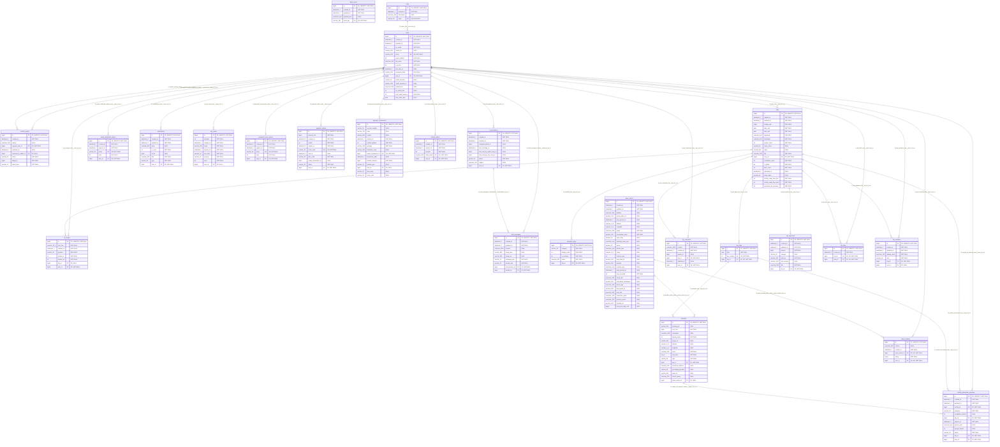

# ChipTrip ERD Mermaid

```mermaid
erDiagram
    activities {
        bigint id PK "PK, IDENTITY, NOT NULL"
        varchar_500 booking_url "NULL"
        bigint cost_vnd "NOT NULL"
        nvarchar_1000 description "NULL"
        int display_order "NOT NULL"
        varchar_500 image_url "NULL"
        numeric_9_6 latitude "NULL"
        numeric_9_6 longitude "NULL"
        nvarchar_255 name "NOT NULL"
        time_7 start_time "NOT NULL"
        varchar_30 type "NOT NULL"
        bigint day_id FK "FK, NOT NULL"
        nvarchar_500 formatted_address "NULL"
        varchar_30 geocoding_provider "NULL"
        varchar_500 place_id "NULL"
        nvarchar_300 search_query "NULL"
        bigint place_cache_id FK "FK, NULL"
    }

    activity_alternative_sessions {
        bigint id PK "PK, IDENTITY, NOT NULL"
        datetime2_7 created_at "NOT NULL"
        datetime2_7 updated_at "NOT NULL"
        bigint activity_id FK "FK, NOT NULL"
        varchar_30 category "NOT NULL"
        int completion_tokens "NULL"
        bigint day_id FK "FK, NOT NULL"
        datetime2_7 expires_at "NOT NULL"
        nvarchar_max options_json "NULL"
        int prompt_tokens "NULL"
        varchar_20 status "NOT NULL"
        bigint trip_id FK "FK, NOT NULL"
        bigint user_id FK "FK, NOT NULL"
    }

    ai_usages {
        bigint id PK "PK, IDENTITY, NOT NULL"
        numeric_10_6 cost_usd "NOT NULL"
        datetime2_7 created_at "NOT NULL"
        varchar_30 provider "NOT NULL"
        int tokens_in "NOT NULL"
        int tokens_out "NOT NULL"
        bigint trip_id FK "FK, NULL"
        bigint user_id FK "FK, NOT NULL"
    }

    chat_messages {
        bigint id PK "PK, IDENTITY, NOT NULL"
        datetime2_7 created_at "NOT NULL"
        datetime2_7 updated_at "NOT NULL"
        nvarchar_2000 content "NULL"
        varchar_300 image_key "NULL"
        varchar_500 image_url "NULL"
        varchar_10 message_type "NOT NULL"
        varchar_10 sender_role "NOT NULL"
        bigint conversation_id FK "FK, NOT NULL"
        bigint sender_id FK "FK, NOT NULL"
    }

    checklist_items {
        bigint id PK "PK, IDENTITY, NOT NULL"
        varchar_30 category "NOT NULL"
        int display_order "NOT NULL"
        bit is_checked "NOT NULL"
        nvarchar_255 name "NOT NULL"
        bigint trip_id FK "FK, NOT NULL"
    }

    content_reports {
        bigint id PK "PK, IDENTITY, NOT NULL"
        datetime2_7 created_at "NOT NULL"
        nvarchar_500 reason "NULL"
        bigint reporter_user_id FK "FK, NOT NULL"
        datetime2_7 resolved_at "NULL"
        bigint resolved_by_admin_id FK "FK, NULL"
        varchar_20 status "NOT NULL"
        bigint target_id "NOT NULL"
        varchar_20 target_type "NOT NULL"
    }

    conversations {
        bigint id PK "PK, IDENTITY, NOT NULL"
        datetime2_7 created_at "NOT NULL"
        datetime2_7 updated_at "NOT NULL"
        bigint assigned_admin_id "NULL"
        datetime2_7 last_message_at "NULL"
        bigint last_read_by_admin_msg_id "NULL"
        bigint last_read_by_user_msg_id "NULL"
        varchar_20 status "NOT NULL"
        nvarchar_200 subject "NULL"
        bigint user_id FK "FK, NOT NULL"
    }

    email_verification_tokens {
        bigint id PK "PK, IDENTITY, NOT NULL"
        datetime2_7 created_at "NOT NULL"
        datetime2_7 expires_at "NOT NULL"
        varchar_36 token UK "UK, NOT NULL"
        bit used "NOT NULL"
        bigint user_id FK "FK, NOT NULL"
    }

    flight_cache {
        bigint id PK "PK, IDENTITY, NOT NULL"
        datetime2_7 created_at "NOT NULL"
        datetime2_7 updated_at "NOT NULL"
        nvarchar_max payload_json "NULL"
        varchar_100 route_key UK "UK, NOT NULL"
    }

    notifications {
        bigint id PK "PK, IDENTITY, NOT NULL"
        datetime2_7 created_at "NOT NULL"
        datetime2_7 updated_at "NOT NULL"
        nvarchar_500 body "NULL"
        bit is_read "NOT NULL"
        bigint ref_id "NULL"
        nvarchar_200 title "NOT NULL"
        varchar_40 type "NOT NULL"
        bigint user_id FK "FK, NOT NULL"
    }

    otp_codes {
        bigint id PK "PK, IDENTITY, NOT NULL"
        int attempts "NOT NULL"
        datetime2_7 created_at "NOT NULL"
        varchar_150 email "NOT NULL"
        datetime2_7 expires_at "NOT NULL"
        varchar_64 otp_hash "NOT NULL"
        varchar_30 purpose "NOT NULL"
        bit used "NOT NULL"
        bigint user_id FK "FK, NULL"
    }

    password_reset_tokens {
        bigint id PK "PK, IDENTITY, NOT NULL"
        datetime2_7 created_at "NOT NULL"
        datetime2_7 expires_at "NOT NULL"
        varchar_36 token UK "UK, NOT NULL"
        bit used "NOT NULL"
        bigint user_id FK "FK, NOT NULL"
    }

    payment_orders {
        bigint id PK "PK, IDENTITY, NOT NULL"
        bigint amount_vnd "NOT NULL"
        datetime2_7 created_at "NOT NULL"
        int credits "NOT NULL"
        datetime2_7 expires_at "NOT NULL"
        varchar_30 order_code UK "UK, NOT NULL"
        datetime2_7 paid_at "NULL"
        varchar_30 plan_code "NOT NULL"
        bigint sepay_transaction_id "NULL"
        varchar_20 status "NOT NULL"
        bigint user_id FK "FK, NOT NULL"
    }

    payment_transactions {
        bigint id PK "PK, IDENTITY, NOT NULL"
        varchar_50 account_number "NULL"
        varchar_100 code "NULL"
        varchar_500 content "NULL"
        datetime2_7 created_at "NOT NULL"
        int credits_granted "NOT NULL"
        varchar_100 gateway "NOT NULL"
        varchar_100 reference_code "NULL"
        bigint sepay_transaction_id UK "UK, NOT NULL"
        datetime2_7 transaction_date "NULL"
        bigint transfer_amount "NOT NULL"
        varchar_10 transfer_type "NULL"
        bigint user_id FK "FK, NULL"
        varchar_30 plan_code "NULL"
        varchar_30 order_code "NULL"
    }

    place_cache {
        bigint id PK "PK, IDENTITY, NOT NULL"
        datetime2_7 created_at "NOT NULL"
        datetime2_7 updated_at "NOT NULL"
        nvarchar_500 address "NULL"
        varchar_512 goong_place_id "NULL"
        datetime2_7 last_synced_at "NULL"
        numeric_9_6 latitude "NULL"
        numeric_9_6 longitude "NULL"
        nvarchar_255 name "NOT NULL"
        varchar_255 normalized_name "NOT NULL"
        varchar_20 open_state "NULL"
        nvarchar_max opening_hours_json "NULL"
        varchar_50 phone "NULL"
        nvarchar_max photos_json "NULL"
        numeric_3_1 rating "NULL"
        int review_count "NULL"
        varchar_255 serp_data_id "NULL"
        varchar_500 website "NULL"
        nvarchar_max reviews_json "NULL"
        datetime2_7 serp_synced_at "NULL"
        bit serp_enriched "NOT NULL"
        nvarchar_255 hours_text "NULL"
        varchar_255 normalized_destination "NULL"
        nvarchar_100 place_type "NULL"
        varchar_255 serp_place_id "NULL"
        nvarchar_255 serp_title "NULL"
        nvarchar_100 commune_name "NULL"
        nvarchar_100 province_name "NULL"
        varchar_500 booking_url "NULL"
        bigint price_per_night_vnd "NULL"
    }

    place_reviews {
        bigint id PK "PK, IDENTITY, NOT NULL"
        nvarchar_500 content "NULL"
        datetime2_7 created_at "NOT NULL"
        bigint place_cache_id FK "FK, UK, NOT NULL"
        tinyint rating "NOT NULL"
        bigint user_id FK "FK, UK, NOT NULL"
    }

    refresh_tokens {
        bigint id PK "PK, IDENTITY, NOT NULL"
        datetime2_7 created_at "NOT NULL"
        datetime2_7 expires_at "NOT NULL"
        bit revoked "NOT NULL"
        varchar_255 token_hash UK "UK, NOT NULL"
        bigint user_id FK "FK, NOT NULL"
    }

    roles {
        bigint id PK "PK, IDENTITY, NOT NULL"
        datetime2_7 created_at "NOT NULL"
        nvarchar_255 description "NULL"
        varchar_50 name UK "UK, NOT NULL"
    }

    trip_comments {
        bigint id PK "PK, IDENTITY, NOT NULL"
        nvarchar_1000 content "NOT NULL"
        datetime2_7 created_at "NOT NULL"
        bigint parent_id "NULL"
        bigint trip_id FK "FK, NOT NULL"
        datetime2_7 updated_at "NULL"
        bigint user_id FK "FK, NOT NULL"
    }

    trip_days {
        bigint id PK "PK, IDENTITY, NOT NULL"
        date date "NOT NULL"
        int day_number UK "UK, NOT NULL"
        bigint trip_id FK "FK, UK, NOT NULL"
    }

    trip_expenses {
        bigint id PK "PK, IDENTITY, NOT NULL"
        datetime2_7 created_at "NOT NULL"
        datetime2_7 updated_at "NOT NULL"
        bigint amount "NOT NULL"
        varchar_50 category "NULL"
        varchar_100 paid_by "NOT NULL"
        varchar_1000 split_among "NULL"
        nvarchar_255 title "NOT NULL"
        bigint trip_id FK "FK, NOT NULL"
    }

    trip_likes {
        bigint id PK "PK, IDENTITY, NOT NULL"
        datetime2_7 created_at "NOT NULL"
        bigint trip_id FK "FK, UK, NOT NULL"
        bigint user_id FK "FK, UK, NOT NULL"
    }

    trip_members {
        bigint id PK "PK, IDENTITY, NOT NULL"
        datetime2_7 created_at "NOT NULL"
        datetime2_7 updated_at "NOT NULL"
        nvarchar_150 display_name "NOT NULL"
        varchar_20 role "NOT NULL"
        bigint trip_id FK "FK, NOT NULL"
        bigint user_id FK "FK, NULL"
    }

    trips {
        bigint id PK "PK, IDENTITY, NOT NULL"
        datetime2_7 created_at "NOT NULL"
        datetime2_7 updated_at "NOT NULL"
        bigint budget_vnd "NOT NULL"
        date date_end "NOT NULL"
        date date_start "NOT NULL"
        nvarchar_150 departure "NOT NULL"
        nvarchar_150 destination "NOT NULL"
        int people_count "NOT NULL"
        varchar_64 share_token "NULL"
        varchar_500 styles "NULL"
        nvarchar_255 title "NOT NULL"
        bigint user_id FK "FK, NOT NULL"
        int comments_count "NOT NULL"
        bit is_public "NOT NULL"
        int likes_count "NOT NULL"
        datetime2_7 published_at "NULL"
        varchar_64 invite_token "NULL"
        int activity_swap_free_limit "NOT NULL"
        int activity_swap_free_used "NOT NULL"
        bit generated_as_premium "NOT NULL"
    }

    users {
        bigint id PK "PK, IDENTITY, NOT NULL"
        datetime2_7 created_at "NOT NULL"
        datetime2_7 updated_at "NOT NULL"
        int ai_credits "NOT NULL"
        varchar_500 avatar_url "NULL"
        varchar_150 email UK "UK, NOT NULL"
        bit email_verified "NOT NULL"
        nvarchar_150 full_name "NOT NULL"
        bit is_active "NOT NULL"
        datetime2_7 last_login_at "NULL"
        varchar_255 password_hash "NOT NULL"
        bigint role_id FK "FK, NOT NULL"
        varchar_20 oauth_provider "NULL"
        varchar_255 oauth_provider_id "NULL"
        nvarchar_500 preferences "NULL"
        int ai_credit_units "NULL"
        int trial_credit_balance "NOT NULL"
        date trial_credit_date "NULL"
    }

    trip_days ||--o{ activities : fk_activities_day__day_id_to_id
    place_cache |o--o{ activities : fk_activities_place_cache__place_cache_id_to_id
    activities ||--o{ activity_alternative_sessions : fk_activity_alt_sessions_activity__activity_id_to_id
    trip_days ||--o{ activity_alternative_sessions : fk_activity_alt_sessions_day__day_id_to_id
    trips ||--o{ activity_alternative_sessions : fk_activity_alt_sessions_trip__trip_id_to_id
    users ||--o{ activity_alternative_sessions : fk_activity_alt_sessions_user__user_id_to_id
    trips |o--o{ ai_usages : fk_ai_usages_trip__trip_id_to_id
    users ||--o{ ai_usages : fk_ai_usages_user__user_id_to_id
    conversations ||--o{ chat_messages : fk_chat_messages_conversation__conversation_id_to_id
    users ||--o{ chat_messages : fk_chat_messages_sender__sender_id_to_id
    trips ||--o{ checklist_items : fk_checklist_trip__trip_id_to_id
    users ||--o{ content_reports : fk_content_reports_reporter__reporter_user_id_to_id
    users |o--o{ content_reports : fk_content_reports_resolved_by_admin__resolved_by_admin_id_to_id
    users ||--o{ conversations : fk_conversations_user__user_id_to_id
    users ||--o{ email_verification_tokens : fk_email_verification_tokens_user__user_id_to_id
    users ||--o{ notifications : fk_notifications_user__user_id_to_id
    users |o--o{ otp_codes : fk_otp_codes_user__user_id_to_id
    users ||--o{ password_reset_tokens : fk_password_reset_tokens_user__user_id_to_id
    users ||--o{ payment_orders : fk_payment_orders_user__user_id_to_id
    users |o--o{ payment_transactions : fk_payment_transactions_user__user_id_to_id
    place_cache ||--o{ place_reviews : fk_place_reviews_place_cache__place_cache_id_to_id
    users ||--o{ place_reviews : fk_place_reviews_user__user_id_to_id
    users ||--o{ refresh_tokens : fk_refresh_tokens_user__user_id_to_id
    trips ||--o{ trip_comments : fk_trip_comments_trip__trip_id_to_id
    users ||--o{ trip_comments : fk_trip_comments_user__user_id_to_id
    trips ||--o{ trip_days : fk_trip_days_trip__trip_id_to_id
    trips ||--o{ trip_expenses : fk_trip_expenses_trip__trip_id_to_id
    trips ||--o{ trip_likes : fk_trip_likes_trip__trip_id_to_id
    users ||--o{ trip_likes : fk_trip_likes_user__user_id_to_id
    trips ||--o{ trip_members : fk_trip_members_trip__trip_id_to_id
    users |o--o{ trip_members : fk_trip_members_user__user_id_to_id
    users ||--o{ trips : fk_trips_user__user_id_to_id
    roles ||--o{ users : fk_users_role__role_id_to_id
```
